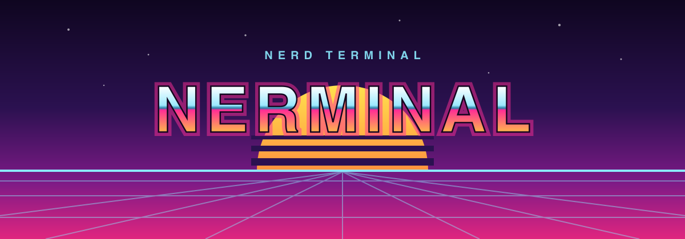

  

A fork of Warp, just for fun.

Warp is the best terminal ever made. I just wanted a simpler one, old school:
no AI, no account, no cloud, nothing that talks to a server.

That is the whole idea.

## Install

    brew install --cask klebeer/nerminal/nerminal

Apple Silicon, macOS 11 and later. Signed and notarized.

## What is different

**Nothing of its own goes over the network**, and there is no account to make.

**Themes.** Nosferatu and Nosferatu Light, Dracula, and Catppuccin in all four
flavours. Mocha is the default.

**Secure keyboard entry.** While the window has focus, other applications
cannot observe your keystrokes, the same protection Terminal and iTerm2 offer.
It matters most at a `sudo` prompt, which the system cannot recognise as a
password field. Off by default, under Settings > Privacy, because the emoji
picker stops working while it is on.

**The Nerd Font is embedded, not downloaded.** Glyphs render on a machine with
nothing else installed, and nothing is fetched to make that happen.

**Copying leaves the padding behind.** A program that redraws its own output
clears each row by writing spaces over it. Those spaces no longer follow the
text to the clipboard, so a line that looked blank stops arriving as a hundred
of them.

**A long URL stays one link** even when the program that printed it split the
address across several lines.

**Pick the browser that opens a link.** `terminal.link_browser` names an
application bundle for links a program printed. Links the app owns keep going
to the system handler.

**Pick the font that fills a gap.** `appearance.text.fallback_font_family`
names the family consulted before the system cascade, so a glyph your
monospace font lacks is drawn by a font you chose.

**Double-click works on CJK.** Fullwidth punctuation ends a word the same way
its ASCII counterpart does, so a selection stops where you expect it to.

**Less on screen.** The buttons that float over a block on hover, the elapsed
time beside each prompt, and the highlight over a selected block can all be
turned off.

## Recommended setup

The app is only half of it. zsh with Prezto and Powerlevel10k is what gives you
completion, syntax highlighting, and a prompt that tells you where you are, and
a handful of brew packages cover the rest: `eza`, `zoxide`, `fzf`, `kubecolor`.
On macOS zsh is already installed, and the Nerd Font it needs is in the app.

[docs/recommended-setup.md](docs/recommended-setup.md)

## Credit

A fork of [warpdotdev/warp](https://github.com/warpdotdev/warp). All credit for
the terminal belongs to Warp. Want the whole product?
[warp.dev](https://www.warp.dev).

Licensing and what changed: [NOTICE.md](NOTICE.md).
