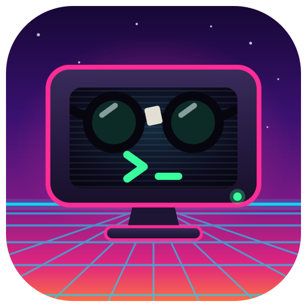

<p align="center">
  
</p>

<h1 align="center">Nerminal</h1>

<p align="center">Nerd Terminal. A fork of Warp that stays on your machine.</p>

## Why this exists

We love Warp. The blocks, the tab sidebar, the panes, the search, the theme
system: that is the good idea, and this fork keeps all of it.

What this fork changes is one thing. It does not talk to anything. No account,
no sign-in, no telemetry, no autoupdate, no server of any kind. Launch it, open
tabs, run commands, split panes, change settings, and it opens no socket to any
host. The only listener is a loopback one it uses to reach its own worker
processes.

That is not a claim about intent, it is a measurement:

```
$ lsof -nP -i -a -p $(pgrep -f Nerminal.app/Contents/MacOS)
nerminal  4875  you  31u  IPv4  TCP 127.0.0.1:9282 (LISTEN)
```

Everything Nerminal keeps, it keeps locally: your settings in
`~/.nerminal/settings.toml`, your command history, your open sessions. Secrets
are redacted before anything reaches the local session database, and that is
not a setting you can turn off.

## What is in the box

| Kept | Gone |
| --- | --- |
| Blocks and block actions | Everything that talks to a server |
| Tab sidebar, panes, vertical tabs | Accounts, sign-in, billing |
| Global search, command palette | Telemetry, crash reporting, autoupdate |
| Themes, fonts, appearance | Cloud sync and shared sessions |
| Workflows, keybindings, vim mode | The onboarding wizard |
| Shell integration, SSH, warpify | Anything that phones home |

Smaller surface, fewer things running, faster startup. That is the whole
product thesis.

## Building

Requires macOS with Xcode.app (not just the Command Line Tools), the Metal
toolchain, `protoc`, `jq` and the Rust toolchain pinned in
`rust-toolchain.toml`.

```bash
xcodebuild -downloadComponent MetalToolchain   # once, ~700 MB
brew install protobuf jq

cargo build --bin nerminal --features gui      # build
./script/macos/run                             # build and run as a real .app
./script/macos/run --release                   # the one you want day to day
```

A debug build carries an on-screen grid and size overlay and runs slowly. Use
`--release`.

## Configuration

| What | Where |
| --- | --- |
| Settings | `~/.nerminal/settings.toml` |
| Themes and workflows | `~/.nerminal/` |
| Application state | `~/Library/Application Support/com.klebeer.Nerminal` |
| Logs | `~/Library/Logs/nerminal.log` |

Coming from Warp? Copy `~/.warp/settings.toml` to `~/.nerminal/settings.toml`.
Theme, font, spacing and notification preferences carry over as they are.

## Relationship to Warp

Nerminal is a fork of [warpdotdev/warp](https://github.com/warpdotdev/warp).
All credit for the terminal belongs there. This is not affiliated with,
endorsed by or sponsored by Denver Technologies, Inc., and it is not a
competing product: it is one person's build for one person's machine.

If you want the full product, with the parts this fork removed, go get the real
thing at [warp.dev](https://www.warp.dev). It is good.

```bash
git remote add upstream https://github.com/warpdotdev/warp.git
git fetch upstream
```

## Licence

AGPL-3.0-only, except `crates/warpui` and `crates/warpui_core`, which are MIT.
Both texts are in this repository as `LICENSE-AGPL` and `LICENSE-MIT`, unchanged
from upstream.

This repository is the complete corresponding source for any Nerminal binary.
If you distribute a modified build, the same obligation passes to you.

See [NOTICE.md](NOTICE.md) for what was changed, when, and the trademark note.
